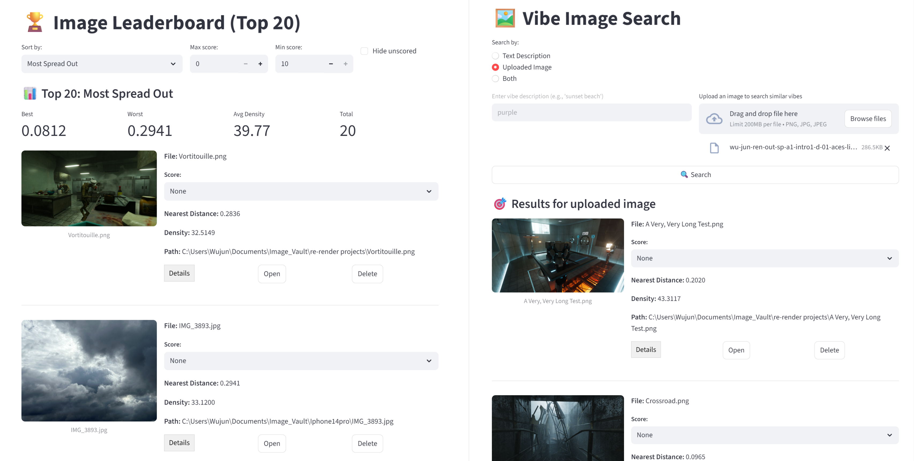

# 🖼️ 调调看图 (Image Vibe Seeker) v0.6.0

[English](README.md) | [简体中文]

> **🎥 观看 1 分钟演示视频 (Bilibili): [链接即将上线]**

**调调看图 (Image Vibe Seeker)** 是一款专注于隐私保护的本地图像库管理工具。
它超越了传统的“文件名”或“修改日期”的检索方式，利用 AI 语义“意境” (Vibes) 帮助你发现、评分和整理海量的视觉数据。

---

## ✨ v0.6.0 新特性：智能与安全更新

### 🧠 行业领先的 AI 模型 (SigLIP 2)
我们已全面迁移至 **2026 行业标准**：SigLIP 2。无论你选择追求速度的 **MobileCLIP 2** 还是追求极致准确度的 **SigLIP 2 Giant**，你的语义搜索现在都将更加精准、支持多语言，并具备更强的视觉感知力。

### 🔐 安全的内存会话
隐私是我们的核心。通过全新的 **Login Gate（登录门）**，数据库密码不再以明文形式存储在磁盘配置文件中。你只需在启动时输入一次密码，它将仅保存在内存 (RAM) 中，并在你关闭应用时自动消失。

### ⚡ “零配置” Demo 模式
暂时不想安装 PostgreSQL？没问题！全新的 **Demo Mode** 内置了 `sqlite-vec`，可瞬间创建一个轻量级的纯本地数据库文件。非常适合小型图库或在 15 秒内快速体验应用核心功能。

### 🌏 智能中国区网络优化
安装程序现已集成高级地域检测。如果你是中国大陆用户，系统将自动把所有 Python 依赖和 Hugging Face 模型下载路由至极速的国内镜像源（如清华源和 `hf-mirror`），彻底告别网络报错。

---

## ✨ 超越搜索：核心体验

### 🌊 意境探索 (Vibe Search)
无法用言语形容你想要的画面？**只需将参考图拖入搜索栏。** 应用会分析其构图、光影和氛围，在你的图库中精准匹配具有相似“意境”的所有图片。这是专为非语言直觉设计的搜索方式。

### 🏆 全库排行榜 (Leaderboard)
让数据驱动你的审美。对整个图库进行数学排名，发现：
*   **深藏不露的明珠 (The Hidden Gems):** 找到你图库中风格最独特、最无可替代的照片。
*   **视觉冗余 (The Clumps):** 识别那些最“普通”或重复度最高的图片——非常适合清理连拍或冗余素材。

### 📔 Obsidian 原生联动
专为 **Obsidian** 用户设计。你分配的每一个评分和标签都会实时存储在 **人类可读的 Markdown 侧边文件** (.md) 中。你的照片不再只是文件，它们是你知识库中可移植、可搜索的笔记。

---

## 💻 系统要求

*   **操作系统**: Windows 10/11, macOS 12.3+, 或 Linux。
*   **数据库**: **PostgreSQL (专业模式)** 或 **Demo Mode (零配置本地 SQLite 模式)**。
*   **内存**: **4GB RAM** (轻量级 Linux/Ubuntu 环境下低至 **2GB** 亦可运行)。
*   **存储空间**: **2GB 可用空间** (包含 AI 环境与基础模型)。
*   **硬件加速**:
    *   **NVIDIA**: 支持 CUDA。
    *   **AMD/Intel**: 支持 DirectML (Windows)。
    *   **Apple Silicon**: 原生 Metal (M1-M5) 支持。

---

## 🚀 一键安装

### 1. 环境准备 (仅限专业模式)
*   **PostgreSQL + pgvector**: [安装指南](https://github.com/pgvector/pgvector#installation)
*   *注：如果你只想快速体验，可以跳过此步，直接使用内置的 "Demo Mode" (本地 SQLite)*。

### 2. 开始安装
*   **Windows**: 双击 **`webui.bat`**。
*   **Mac / Linux**: 运行 **`./webui.sh`**。

> **💡 小贴士 (离线模型):** 如果你已通过其他渠道下载了 `.safetensors` 模型文件，可以直接将其放入 `models/` 对应的子目录中。应用将自动识别并跳过 10GB 的在线下载过程！

### 3. 快速上手
应用将引导你完成后续步骤：
1.  **登录:** 选择 **Demo Mode** 即刻开启零配置体验，或连接 **PostgreSQL** 享受专业级性能。
2.  **维护 (Maintenance):** 设置你的图片文件夹路径，点击 **🚀 Start Sync & Embed**。
3.  **探索:** 导航至 **Vibe Search** 开始你的意境搜寻。

---

## 🗺️ 路线图：未来愿景

*   **全格式支持:** 逐步支持 **WebP, HEIC, DNG (RAW)** 和 **EXR (HDR)**。
*   **星系视图 (Galaxy Update):** 基于 UMAP 的 3D 聚类可视化。
*   **生态联动:** 开发原生 **Obsidian 插件** 和 **MCP 服务**，让你的 AI 助手也能“看见”你的图库。

---

## 💬 社区与支持

欢迎加入我们的 **[Discord 服务器](https://discord.gg/Z9dC7TmuHe)** 交流心得、反馈 Bug 或获取设置帮助！

---

*隐私声明: 100% 本地运行。你的所有“意境”数据都仅保存在你自己的机器上。*
